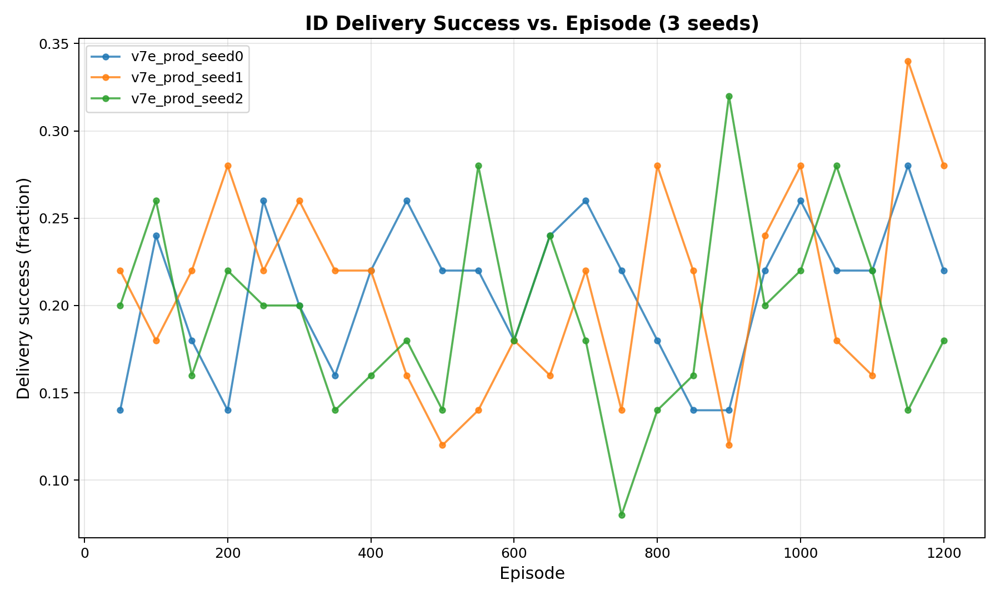
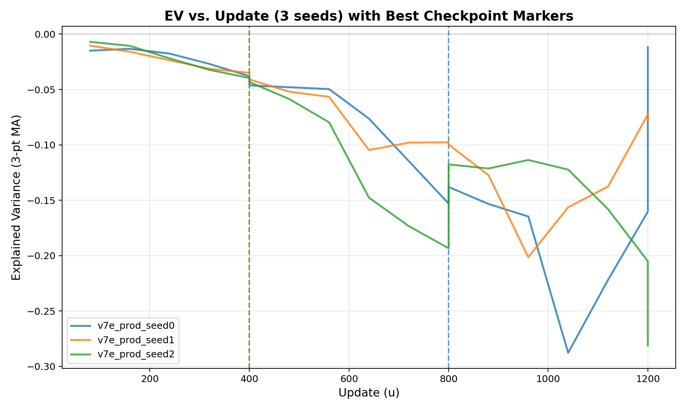
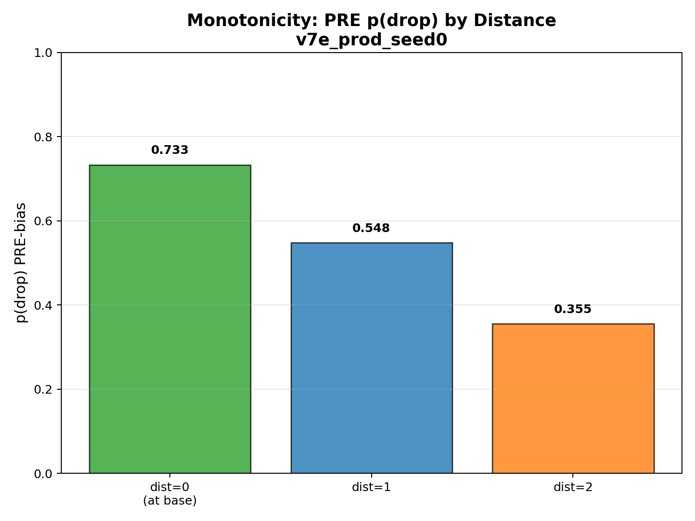

# MARL 3D IMPALA/V-trace — Phase-1 Foundation (Artifact Repo)

This repository publishes **Phase-1 artifacts** for a 3D multi-agent pickup-and-deliver task trained with an **IMPALA-style actor/learner** and **V-trace** off-policy correction.  
It focuses on **learning stability**, **diagnostics**, and **evaluation hygiene**.  
> **Note:** The training code and proprietary environment are intentionally **not** included; this is an **artifact-only** portfolio repo (plots + per-seed metrics + checkpoint selection metadata).

## Environment & Architecture (one paragraph)
- **Task:** multi-agent pickup-and-deliver in a 3D grid. Agents pick treasure and drop at a base (sparse rewards). Legality masks prevent invalid actions.
- **Learning stack:** IMPALA actor/learner with **V-trace** targets, blended with **TD(λ)**; **EMA target** smoothing for the critic; no per-batch circular normalization; value-only smoothing; separate optimizer schedule for value head.
- **Behavioral shaping:** distance-scaled feature + tiny **learnable monotone prior** on drop logits ensures **PRE monotonicity** (closer → higher drop prob).
- **Gates & health checks:** KL/entropy bounds, near-zero off-policy clipping, legality audits, monotonicity gate, and explained-variance (EV) tracking.

---

## Phase-1 Results (3 seeds)

### Figure 1 — ID Delivery Success vs. Episode

Median ID success ≈ **22%** across three seeds (range ~18–28%), matching the Phase-1 target for this sparse-reward baseline.

### Figure 2 — Explained Variance (EV) with Best-Checkpoint Markers

EV tracked over training (3-pt moving average). **Dashed lines** mark the EV-selected checkpoints:
- Seed 0: **u=800**, EV ≈ −0.073  
- Seed 1: **u=400**, EV ≈ −0.045  
- Seed 2: **u=400**, EV ≈ −0.102

> **EV note:** In sparse-reward settings we do **not** expect EV>0.1 early. Our Phase-1 acceptance floor is **EV ≥ −0.15 at the chosen checkpoint**; the median best EV is **−0.073** (well above the floor).

### Figure 3 — PRE Monotonicity of Drop Probability

PRE p(drop | carry & near base) decreases with distance. All seeds pass with large margins:
- Δ = p(d=1) − p(d=2) ≈ **+0.19 ~ +0.22** (≫ +0.01 threshold)

---

## Multi-Seed Summary

| Seed | Best EV (EV-selected ckpt) | Latest ID success |
|:---:|:---------------------------:|:-----------------:|
| 0   | −0.073 @ u=800              | ~0.22             |
| 1   | −0.045 @ u=400              | ~0.28             |
| 2   | −0.102 @ u=400              | ~0.18             |

**Medians (IQR)**  
- Best EV: **−0.073** (IQR [−0.101, −0.045])  
- ID success: **~22%** (18–28%)

**Health checks (all seeds)**  
- KL ~0.016 (**<0.03**)  
- Entropy ~1.95 (**[1.5, 2.5]**)  
- Off-policy clipping ~0–0.1% (**<5%**)  
- Legality: **~100%**  
- PRE Monotonicity Δ: **~+0.20** (**≥+0.01**)  
- EV (best-ckpt): median **−0.073** (**≥ −0.15** floor)

---

## What this shows (Phase-1 scope)

- **Learning is real:** delivery success stabilizes around ~20% on a non-trivial multi-agent 3D task; EV-selected checkpoints generalize across seeds.  
- **Foundation is correct:** IMPALA/V-trace math is healthy (low clipping; sane KL/entropy), critic is stable post-fix, and PRE monotonicity is strong via a principled shaping prior.  
- **Reproducible artifacts:** multi-seed metrics, plots, and checkpoint **provenance** (`best_checkpoint.meta.json`) are included.

> **Limitations (by design):** This is an artifact-only repository. The training stack and environment are proprietary and excluded. OOD eval and richer ecologies will arrive in Phase-2.

---

## Artifacts

- Plots: `results/plots/*.png`  
- Per-seed eval: `results/seeds/seed*/eval_id.json`  
- Monotonicity extracts: `results/seeds/seed*/bias.jsonl`  
- Checkpoint provenance: `results/seeds/seed*/best_checkpoint.meta.json`  
- (Optional) Model files via Git LFS later.

---

## Roadmap

- **Phase-2:** minimal public baseline code + toy env; OOD mini-eval suites (r+1, grid+1); curriculum knobs; ablations (EV vs. normalization).  
- **Phase-3:** richer ecologies, multi-agent coordination, communication channels, league training.

---
